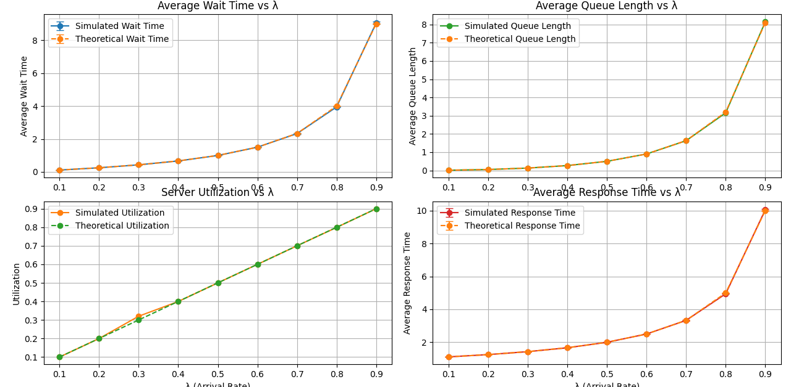
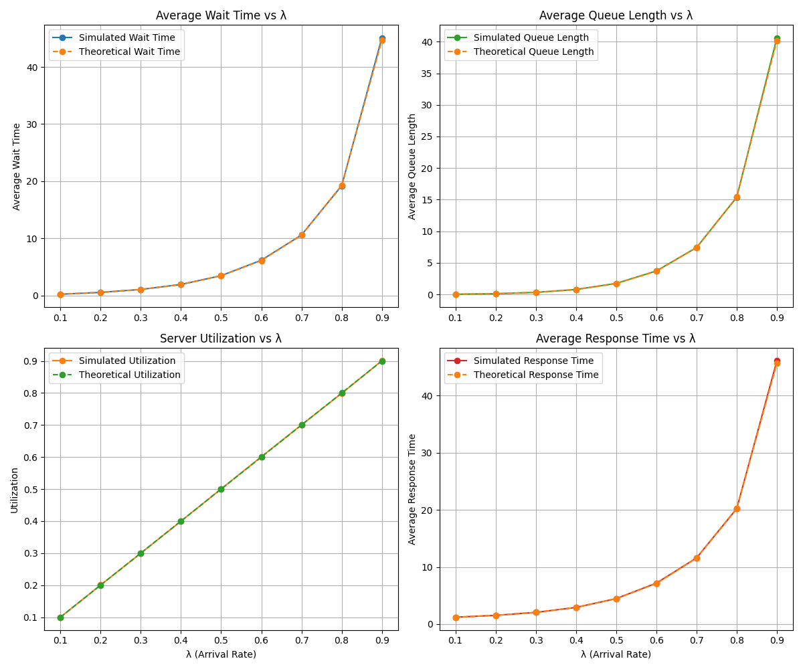
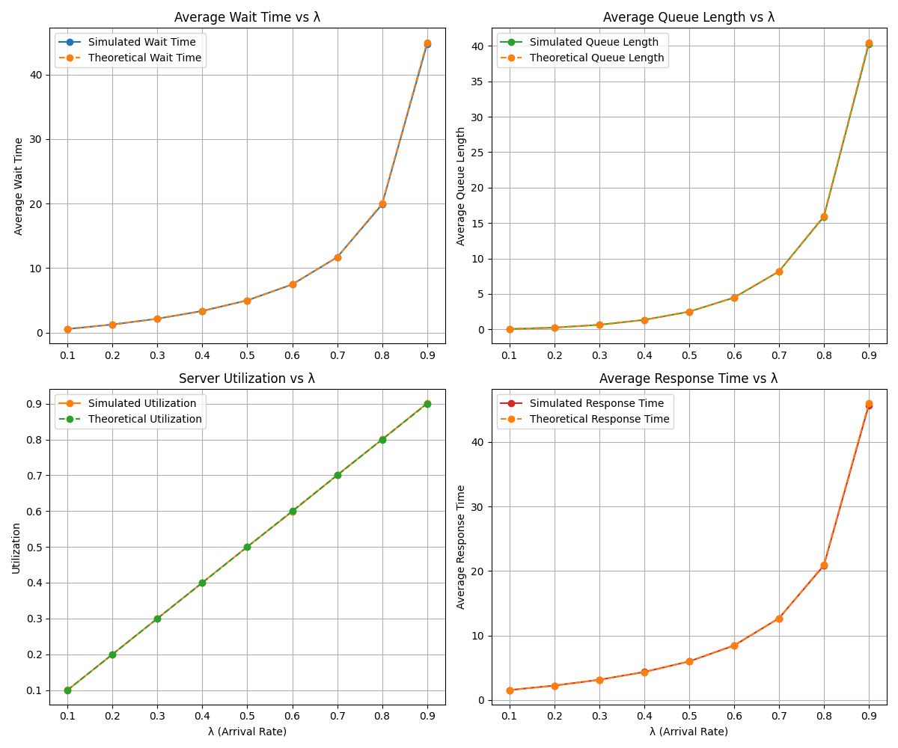
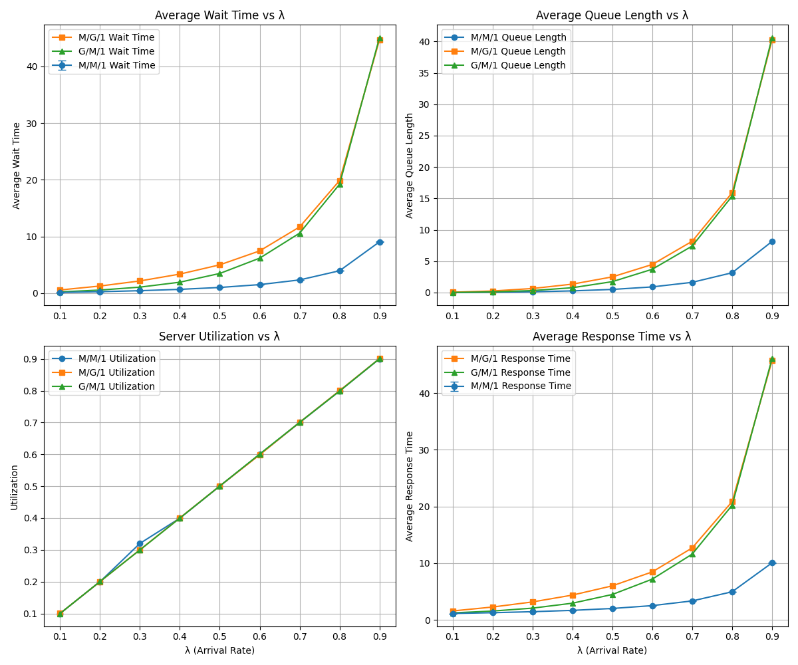

# Projet de Modélisation et Simulation des Files d'Attente

## 🔍 Présentation Générale

Ce projet a pour but de modéliser et simuler trois types de files d'attente classiques en théorie des files : **M/M/1**, **G/M/1** et **M/G/1**. L'objectif principal est de comparer les résultats théoriques avec les résultats obtenus par simulation, et d'analyser les performances des trois systèmes.

---

## 📌 File d'attente M/M/1

### Présentation

Le modèle **M/M/1** est le plus simple des systèmes de files d'attente. Il se caractérise par :
- Des arrivées selon un **processus de Poisson** (distribution exponentielle des inter-arrivées),
- Un seul serveur,
- Des durées de service également **exponentielles** (donc sans mémoire),
- Une discipline FIFO (First-In-First-Out).

### 📊 Résultats obtenus

Ci-dessous, une comparaison entre les **valeurs théoriques** et les **valeurs simulées** pour le système M/M/1 :

---

## 📌 File d'attente G/M/1

### Présentation

Le modèle **G/M/1** généralise le M/M/1 en permettant **n’importe quelle loi** de distribution pour les inter-arrivées (loi G), tout en conservant une **loi exponentielle** pour les temps de service.

Dans notre simulation, nous avons utilisé une **loi hyperexponentielle** pour modéliser la loi G (car elle a une variance plus grande que l'exponentielle, ce qui est courant dans les systèmes réels).

**Remarque** : La loi hyperexponentielle ne satisfait pas la propriété de "sans mémoire", c’est pourquoi les **arrivées ont été générées à l’avance**.
Donc quand λ augmente, tu as plus d’observations dans le même intervalle de temps, ce qui rend les statistiques simulées plus stables, et la convergence vers la théorie est meilleure.

### 📊 Résultats obtenus

Comparaison entre les valeurs théoriques et simulées pour le système G/M/1 :

---

## 📌 File d'attente M/G/1

### Présentation

Le modèle **M/G/1** conserve les **arrivées exponentielles** (donc sans mémoire), mais permet **n’importe quelle loi de service**. Dans notre cas, nous avons utilisé une **loi hyperexponentielle** pour simuler les temps de service.

### 📊 Résultats obtenus

Comparaison entre les valeurs théoriques et simulées pour le système M/G/1 :

---

## 📈 Comparaison Globale des Systèmes

Nous comparons ici les trois systèmes **M/M/1**, **G/M/1**, et **M/G/1** selon les critères suivants :

- ⏱️ **Temps moyen de réponse**
- 🕒 **Temps moyen d’attente**
- 📦 **Taille moyenne de la file**
- ⚙️ **Taux d’occupation du serveur**

---

## 📝 Conclusion

Ce projet nous a permis de mieux comprendre les comportements de différents types de files d’attente. Les résultats montrent que :

- La nature de la loi d’inter-arrivée ou de service influence fortement les performances du système,
- Les modèles plus généraux (G/M/1 et M/G/1) se rapprochent mieux des situations réelles, mais leur analyse théorique devient plus complexe,
- La simulation permet de compléter et valider les résultats théoriques.

